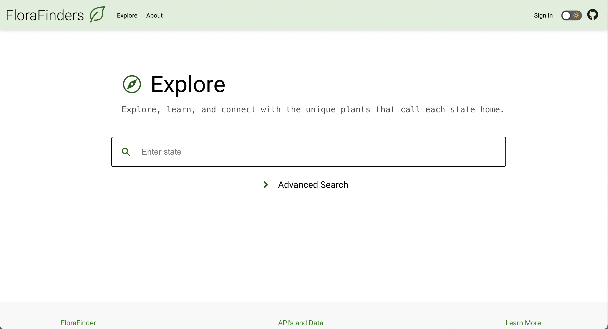
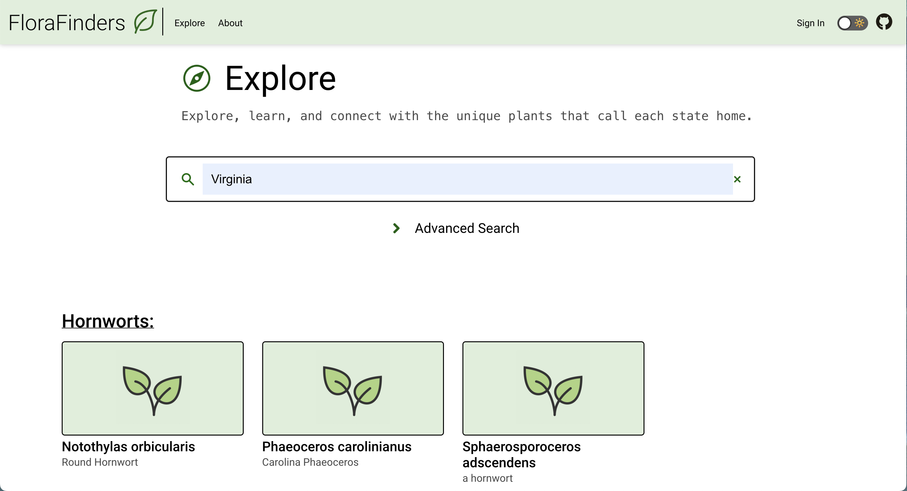
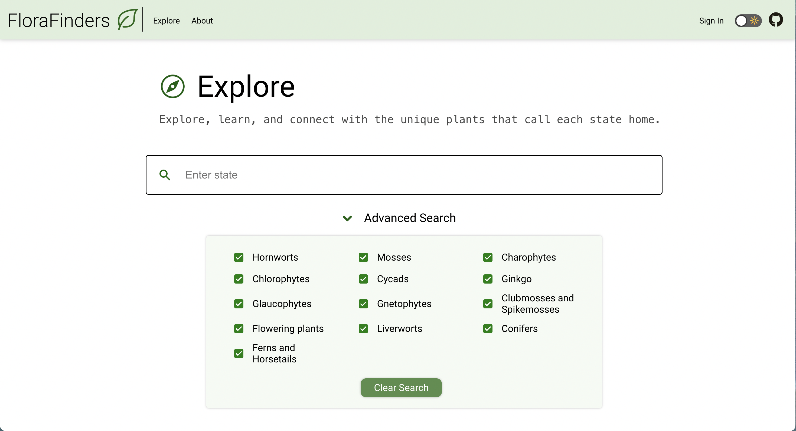
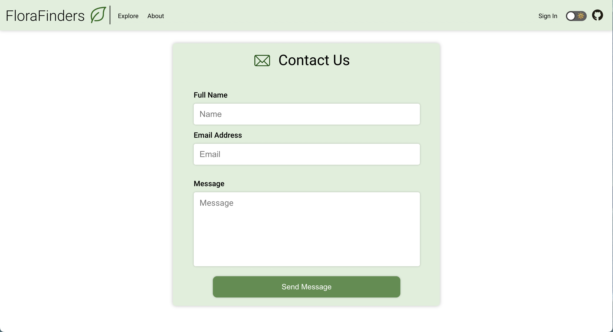
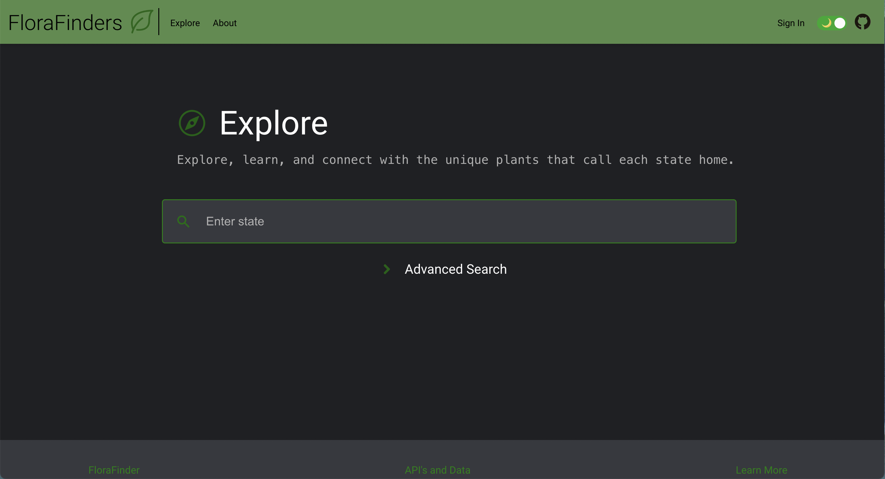
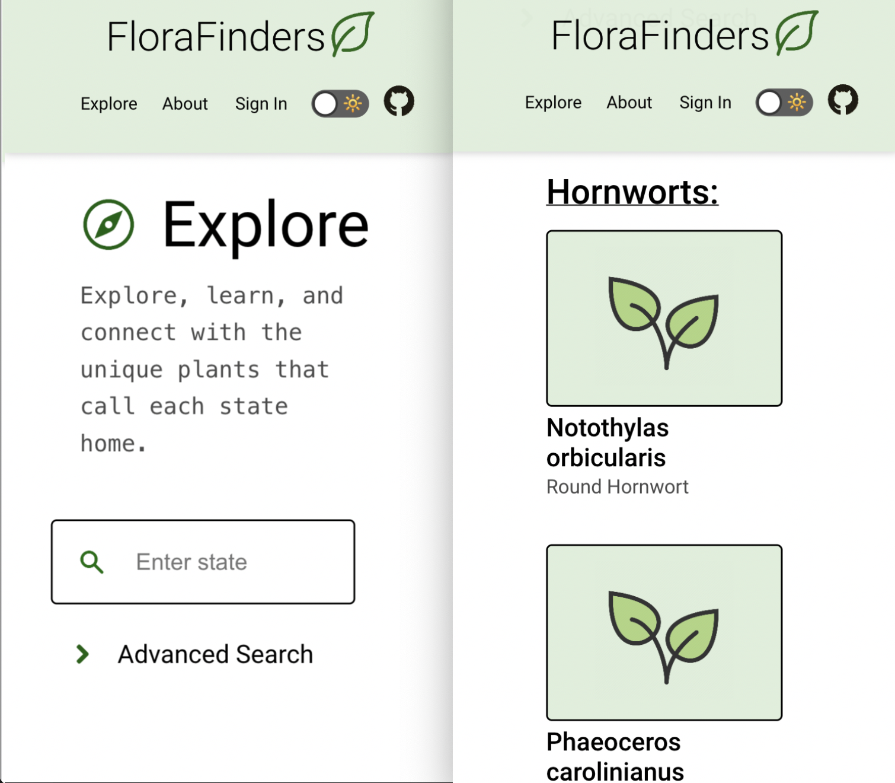

# FloraFinders
<table>
<tr>
<td>
  FloraFinders is a website created using ReactJS, which allows users to search for native plants by state. It integrates Trefle REST API and NatureServe Explorer REST API to fetch and display plant data, enabling users to access information about 1000+ native plants. It also incoorperates a robust search feature that enables users to filter by 14 different phylums. By seamlessly enabling users to search for and discover the unique flora of their region, Florafinders strives to cultivate a sense of appreciation for local biodiversity.
</td>
</tr>
</table>

## Demo
Here is a working live demo :  https://mlaflam.github.io/flora-finder/

## Site

### Explore Page
Currently it is working on all NSE (India) Stocks, BSE (India) Stocks Symbol will be added soon.

### Example Search

### Advanced Search

### Contact Us

### Darkmode

## Mobile support
The WebApp is compatible with devices of all sizes and all OS's, and consistent improvements are being made.

### Development
Want to contribute? Great!

To fix a bug or enhance an existing feature, follow these steps:

- Fork the repo
- Create a new branch (`git checkout -b improve-feature`)
- Make the appropriate changes in the files
- Add changes to reflect the changes made
- Commit your changes (`git commit -am 'Improve feature'`)
- Push to the branch (`git push origin improve-feature`)
- Create a Pull Request 

### Bug / Feature Request

If you find a bug, kindly open an issue in the Contact Us form in the About page [here](https://mlaflam.github.io/flora-finder/). Please include a description of your issue so that we can do our best to resolve it and enhance your user experience. 

## Built with 

- [NatureServe Explorer REST API](https://explorer.natureserve.org/api-docs/) - A Biodiversity Information Service that provides access to a wealth of data related to species and ecosystems.

- [Trefle REST API](https://docs.trefle.io/) - A comprehensive botanical database that offers extensive information about a wide range of plant species.

- [React](https://react.dev/) - JavaScript library for building user interfaces and applications.

## To-do
- Add Sign In option
- Allow signed in users to like plants
- Integrate with TrefleAPI to upload pictures of searched plants
